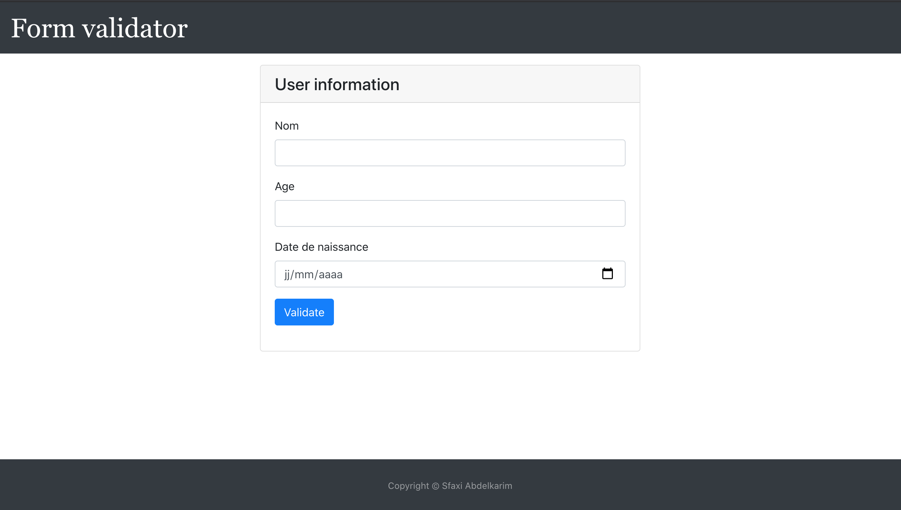
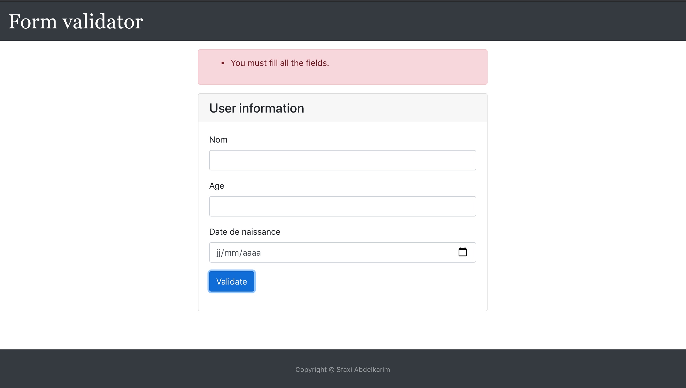
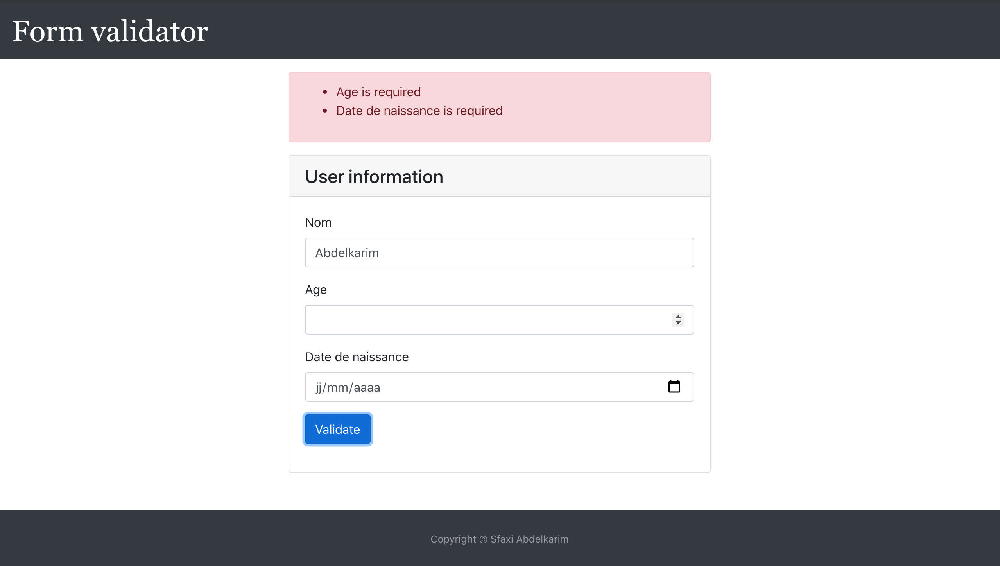
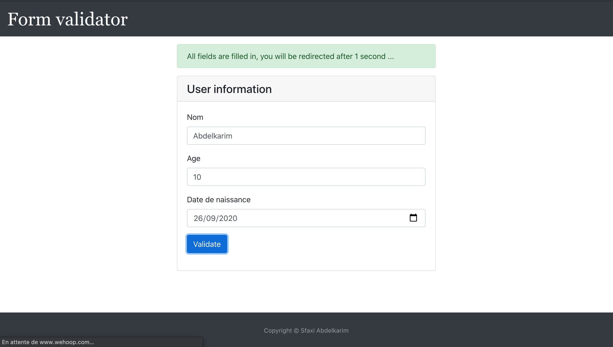

# form-validator

# Screen

</br>

</br>

</br>

</br>


## Requirements

- **Node.js** (LTS) version installed (v12.x Dubnium preferred),
- **yarn** or **npm** installed and up to date,
- **IDE** of your choice with React and Typescript support.

# Install project </br>
First, clone the repo via git:

```bash
$ git clone https://gitlab.satoripop.com/quicktext/widget.git
```

Then, get in the project directory.

```bash
$ cd Form-validator
```
And then install dependencies with yarn or npm.

```bash 
$ nvm use 12
```
```bash
$ npm install
``` 
```bash
$ npm start
```

## Browser Support

|  |  |  |  |  |  |
| ---------------------------------------------------------------------------------------- | ------------------------------------------------------------------------------------------- | ---------------------------------------------------------------------------------------- | ------------------------------------------------------------------------------------- | ---------------------------------------------------------------------------------- | ---------------------------------------------------------------------------------------------------------------------------- |
| Desktop ✔                                                                                | Desktop ✔                                                                                   | Desktop ✔                                                                                | Desktop ✔                                                                             | Desktop ✔                                                                          | ~~11 ❌~~                                                                                                                    |
| Mobile ✔                                                                                 | Mobile ✔                                                                                    | Mobile ✔                                                                                 | Mobile ✔                                                                              | Mobile ✔                                                                           | ~~9 ❌~~                                                                                                                     |


# Design(with better features)
-bootstrap</br>
-css</br>

# Hire Me</br>

For all requests please email me at sfaxi.abdelkarim@gmail.com
